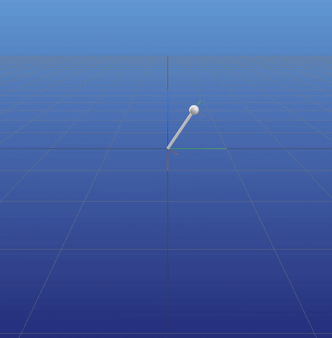
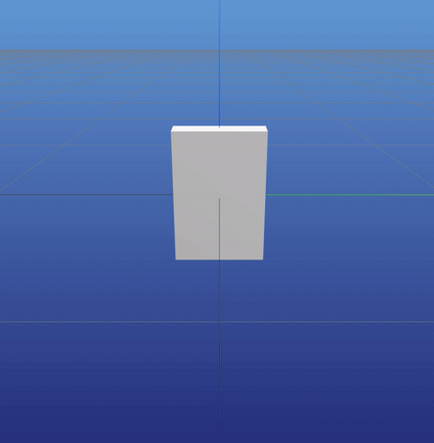

# jax_rbt

This is a JAX implementation of rigid body dynamics algorithms. The goal is to provide a simple, easy to understand implementation of the algorithms described in the textbook "Rigid Body Dynamics Algorithms" by Roy Featherstone.

[Here is a link](https://bcourses.berkeley.edu/files/70847609/download?download_frd=1) to a free PDF of the book. This [jupyter notebook](featherstone_notes.ipynb) contains my notes on the book.

### Setup

```
pip install jax jaxlib meshcat
```


## Why JAX

I chose to use JAX because it's very similar to numpy, but it enables jitting and automatic differentiation.

My intitial experimnts with jitting forward kinematics (FD), inverse dynamics (ID), and forward dynamics (FD) produced encouraging results.

```sh
# Before jitting:
$ python run.py --model=arm5 --experiment=timeit
    FK: 30.938 ms
    ID: 94.543 ms
    FD: 549.681 ms

# After jitting:
$ python run.py --model=arm5 --experiment=timeit
    FK: 1.807 ms
    ID: 0.014 ms
    FD: 0.025 ms
```

## Some sim examples

A simple pendulum: `python run.py --model=pendulum --experiment=sim`



A box exhitting the [tennis racket theorem](https://en.wikipedia.org/wiki/Tennis_racket_theorem): `python run.py --model=box --experiment=sim`


